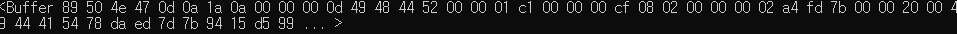

# NodeJS - image down

안녕하세요. 이번 시간은 쉬어가는 코너입니다.

nodejs에서 url 주소를 통해 다른 사이트에 있는 이미지를 가져 오는 방법입니다.

간단하게 원리를 설명드리고 코드 첨부하겠습니다.

request요청을 통해 웹사이트로부터 데이터를 받습니다. image 경로를 요청하면 웹에서는 reponse를 통해 데이터를 넘겨받게 됩니다.  인코딩을 하지 않고 데이터를 받게되면



이러한 핵사코드의 형태로 받게 됩니다.  이 데이터를 확장자가 jpg나 png와 같은 그림파일로 열게 되면 우리가 볼 수 있는 이미지가 되게 됩니다.

원리는 매우 간단하죠!?

그런데!  코드는 더욱 간단합니다.

```
const request = require('request'); //request 모듈 호출
const fs = require('fs'); //fs모듈 호출 -> 파일관리를 위해 사용
let option = {
    url : '',
    method : 'GET',
    encoding : null,
}
//option으로 url / path
let app = { //모듈형태로 만들기 위해...
    'imgDown' : (obj)=>{
        option.url = obj.url;
        this.path = obj.path;
        this.name = obj.name;
        request(option).pipe(fs.createWriteStream(this.path+'/'+this.name+'.jpg'));
    }
}
```


url을 입력받아 request요청을 get방식으로 보냅니다. 그리고 pipe함수를 사용하여 받아오는 데이터순서대로 fs모듈을 통해 파일을 생성하여 데이터를 집어 넣습니다.

모듈없이 순수 작업하려면 엄청 길어지는 코드가 이렇게 단 몇 줄만에 가능하다니... !!

nodejs를 쓰면서 npm생태계가 얼마나 중요한지 그리고 opensource로 올라오는 모듈들에 대해서 얼마나 감사한지 다시 한 번 느낍니다... ㅜ